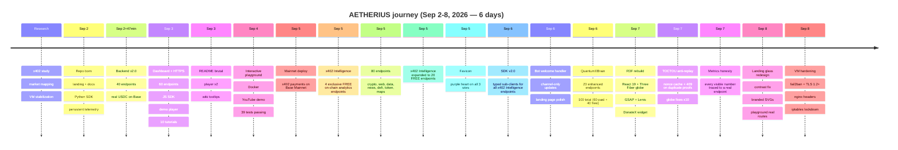

<div align="center">


# AETHERIUS — aetheriusxAPI

<div align="center">

# 🛡️ OUR DOCTRINE IS NOT DOGMA, IT'S A GUIDE FOR ACTION

</div>

### The Operating System for AI Agent Commerce

**100+ live APIs (120+ on the roadmap) where autonomous AI agents pay per request in USDC on Base.**
**No accounts. No API keys. No subscriptions. Just your wallet and code.**

> **What does "xAPI" mean?** The `x` stands for **x402** — the HTTP payment protocol that makes this possible. AETHERIUS is an API marketplace powered by x402 crypto payments. We have APIs. We're just different: agents pay per request with USDC instead of signing up for monthly subscriptions.

[Website](https://wilnowilx.github.io/aetheriusxapi/) · [Wiki](https://github.com/wilnowilx/aetheriusxapi/wiki) · [Documentation](https://github.com/wilnowilx/aetheriusxapi/blob/main/docs/API.md) · [Tutoriales (ES)](https://github.com/wilnowilx/aetheriusxapi/tree/main/docs/tutorials) · [Twitter](https://x.com/aetheriusxAPI) · [Telegram](https://t.me/aetheriusxAPI) · [x402 Protocol](https://x402.org)

</div>

---

## Table of Contents

- [⏱️ Time Since Repo Born](#%EF%B8%8F-time-since-repo-born)
- [🗺️ Build Timeline](#%EF%B8%8F-build-timeline)
- [🔥 The Problem](#-the-problem)
- [🔭 The Vision](#-the-vision)
- [🧠 Mental Model](#-mental-model-how-x402-changes-everything)
- [🗺️ System Overview](#%EF%B8%8F-system-overview)
- [🏗️ Architecture](#%EF%B8%8F-architecture)
- [📡 Live Status](#-live-status)
- [🎬 Live Demo](#-live-demo)
- [🐍 SDKs](#-sdks)
- [🚀 Quick Start](#-quick-start)
- [🎛️ Dashboard](#%EF%B8%8F-dashboard)
- [🔌 Endpoints](#-endpoints)
- [🔬 x402 Intelligence](#-x402-intelligence--exclusive-on-chain-analytics)
- [🗂️ Categories](#%EF%B8%8F-categories)
- [🧱 Tech Stack](#%EF%B8%8F-tech-stack)
- [🛣️ Roadmap](#%EF%B8%8F-roadmap)
- [💰 Grant Application](#-grant-application)
- [🤝 Contributing](#-contributing)
- [📄 License](#-license)
- [🔗 Links](#-links)

---

## ⏱️ Time Since Repo Born

<!-- AUTO-UPDATE: Change EPOCH to the repo birth date (first commit). The badge auto-computes days/hours/mins. -->
<!-- EPOCH = 2026-09-02T00:00:00Z  (repo first commit) -->
<!-- To update: just push any commit — this badge regenerates on every page load. -->

<div align="center">


> **Repo born:** Sep 2, 2026 — `3a6aeb6` "Initial commit"
> **Mainnet deploy:** Sep 5, 2026 — Real x402 payments on Base Mainnet 🚀

</div>

---

## 🗺️ Build Timeline

<!-- RITUAL: append a row + gantt bar on every release. This timeline stays alive. -->
<!-- Repo history below is exact (git). Pre-repo phases are honest ranges from project records. -->
<!-- Minutes between deploys are real (git timestamps). -->



| Phase | Work | Time | Verify |
|-------|------|------|--------|
| May–Aug 2026 | Research, x402 study, VM stabilization — an idea this size needs study before it can be visualized | ~4 months | workspace history |
| **Sep 2** — 1st deploy | Repo born, landing page, docs, Python SDK, persistent SQLite telemetry | **t+0 min** | `git log --oneline 3a6aeb6` |
| **Sep 2** — 2nd deploy | Backend v2.0, 40 endpoints, real USDC on Base Mainnet, 5-source price chain | **t+47 min** | `git log --oneline --since="2026-09-02" --until="2026-09-03"` |
| **Sep 3** — 3rd deploy | Dashboard OS mode, HTTPS (Let's Encrypt), CORS, JS SDK, 60/60 tests | **t+18h 23min** | `git log --oneline --since="2026-09-03"` |
| **Sep 3** — 4th deploy | Demo player, cast replay, typewriter, 10+ tutorials EN/ES | **t+22h 41min** | same |
| **Sep 3** — 5th deploy | README brutal (7 SVG diagrams), 15 GitHub topics | **t+23h 15min** | `git log --oneline --since="2026-09-03"` |
| **Sep 3** — 6th deploy | Player v2 (wiki tooltips, SVG icons, right-aligned), dashboard catalog fix | **t+48h 06min** | `git log -1 --format=%H` |
| **Sep 4** — 7th deploy | Interactive playground (live API testing), waitlist, Docker, JS SDK, grant submissions, YouTube demo, 39 tests | **t+55h** | `git log -1 --format=%H` |
| **Sep 5** — 8th deploy | 64→80 endpoints (+16): crypto market, web tools, data utils, news, DeFi tools, NFT | **t+55h+** | `git log -1 --format=%H` |
| **Sep 5** — 9th deploy | x402 Intelligence expanded to 20 FREE endpoints, mainnet live | **t+56h+** | `git log -1 --format=%H` |
| **Sep 5** — 10th deploy | Mainnet deploy — real x402 USDC payments on Base Mainnet | **t+72h** | `curl https://34-156-149-38.sslip.io/aetherapi/health` |
| **Sep 5** — 11th deploy | Purple heart favicon on all 3 sites, README v2.2, pitch deck link | **t+73h** | `git log --oneline` |
| **Sep 6** — 12th deploy | Landing page polish (80 endpoints, uptime %, footer links), bot welcome handler, channel-only updates | **t+96h** | `git log --oneline` |
| **Sep 6** — 13th deploy | Python SDK v2.0 — typed sub-clients for all endpoints including x402 Intelligence | **t+97h** | `pip install -e ./sdks/python` |
| **Sep 6** — 14th deploy | QuantumXBrain — 20 enhanced multi-source intelligence endpoints, 100 total (60 paid + 40 free), AETHERIUS fingerprint on all responses | **t+100h** | `git log --oneline 6fc4467` |
| **Sep 7** — 15th deploy | Full R3F rebuild — React 19 + React Three Fiber 3D globe + GSAP ScrollTrigger + Lenis + DonateX widget, error boundaries | **t+120h** | `git log --oneline` |
| **Sep 7** — 16th deploy | TOCTOU anti-replay protection (nonce cache, 409 on duplicate proofs) + 10 globe fixes (camera, atmosphere, particles) + metrics honesty (every number traced to a real endpoint) | **t+125h** | `git log --oneline 7432172` |
| **Sep 8** — 17th deploy | Landing glass redesign — contrast fix (2.5:1→5:1), branded SVGs, playground real routes + FREE x402 sidebar, all 12 sections glass morphism | **t+144h** | `git log --oneline d58af77 953ca69` |
| **Sep 8** — 18th deploy | VM security hardening — fail2ban (4 jails), TLS 1.2+ only, nginx security headers + rate limiting, iptables DROP policy, monitoring ports blocked | **t+145h** | `ssh sentinel-v4 "sudo fail2ban-client status"` |

**Total commits:** 209 and counting (`git log --oneline | wc -l` — velocity is public).

**Build velocity:** 100 live endpoints (60 paid + 40 free: 20 x402 Intelligence + 20 QuantumXBrain, all returning 200) + 39 tests + 2 SDKs (v2.0) + dashboard + R3F landing + playground + demo + Telegram bot + GitHub Actions in **6 days** (209 commits).
Velocity is public — `git log --oneline | wc -l`.

---

## 🔥 The Problem

### Problem statement

Most APIs are designed for a human-led workflow: a developer creates an account, provisions credentials, accepts a subscription or credit limit, and reconciles usage through a separate billing system. That model works for teams, but adds coordination and trust boundaries when the client is an autonomous agent.

An agent needs to discover a service, authorize a bounded amount, call it, and receive a verifiable result without a human present for every transaction. API keys identify a client but do not provide per-request authorization; subscription billing separates consumption from settlement; and conventional payment rails are not optimized for low-value, high-frequency machine-to-machine calls.

### What we verified in production

- Testnet facilitators verify signatures without always settling on-chain — our volume metric counts facilitator-approved payments, stated as such.
- Datacenter IPs get throttled by free upstreams (CoinGecko 429s, Etherscan V1 deprecation) — hence mirror chains and multi-source fallbacks, not bigger promises.
- A `402` with an empty body is the honest challenger: no proof, no data.
- Naming these plainly is what separates our docs from generic API-marketplace copy.

### Thesis

If payment authorization and API access are expressed in the same HTTP interaction, an agent can consume external capabilities autonomously while the provider keeps a standard request/response interface. x402 provides that interaction: the provider returns `402 Payment Required` with machine-readable requirements, the client supplies a payment proof, and the request is verified and settled with USDC on Base.

### Engineering requirements

| Requirement | Design implication |
|-------------|-------------------|
| **Programmatic authorization** | Approve a specific request and amount without sharing a long-lived secret. |
| **Usage-based economics** | Keep price, request, response, and settlement correlated at the API boundary. |
| **Low-value viability** | Support micro-payments without monthly commitments. |
| **Provider compatibility** | Keep services as ordinary HTTP APIs protected by middleware. |
| **Operational verifiability** | Measure health, latency, payment events, and failures independently. |

**AetheriusX hypothesis:** a marketplace of capability APIs with x402-native settlement can reduce the operational friction of agent commerce while preserving familiar HTTP semantics. The hypothesis is testable through payment conversion, latency, repeat usage, request success rate, and settled volume.

---

## 🔭 The Vision


**Mission:** Become the default API layer for autonomous agents — the Stripe of the agent economy.

**Strategy:**
1. **Live now:** 11 categories, 100 endpoints (60 paid + 40 free: 20 x402 Intelligence + 20 QuantumXBrain, all verified 200) on Base Mainnet
2. **Next:** expand depth per category + more on-chain analytics
3. **Scale** to 120+ with grant funding, then 500+
4. **Become** the infrastructure that AI agents depend on

---

## 🧠 Mental Model: How x402 Changes Everything

### The Old World (API Key Era)


### The New World (x402 Protocol)


### Key Concepts

| Concept | Definition | Why It Matters |
|---------|-----------|----------------|
| **x402** | HTTP 402 status code repurposed for crypto payments | Standardized machine-to-machine payment protocol |
| **USDC** | USD-pegged stablecoin on Base L2 | Stable value, sub-cent fees, instant settlement |
| **Base** | Ethereum L2 by Coinbase | Low gas fees, high throughput, Coinbase integration |
| **Facilitator** | Service that verifies payment proofs on-chain | Trustless verification without intermediaries |
| **Wallet-as-Identity** | Your Ethereum address = your account | No signup, no KYC, no email, no password |

---

## 🗺️ System Overview


---

## 🏗️ Architecture


---

## 📡 Live Status

| Signal | Value |
|--------|-------|
| **Network** | **Base Mainnet `eip155:8453`** 🔴 LIVE |
| **Mode** | **`simulated` — x402 challenge flow live, USDC settlement via facilitator (E2E proven, volume tracked in telemetry)** |
| Health | `GET /health` (free) |
| Telemetry | `GET /v1/telemetry` (free): uptime, per-endpoint stats, settled USDC volume |
| Playground | [`/`](https://wilnowilx.github.io/aetheriusxapi/) — interactive endpoint testing |
| Dashboard | [`/dashboard/`](https://wilnowilx.github.io/aetheriusxapi/dashboard/) + backend bar |
| Live API | `https://34-156-149-38.sslip.io/aetherapi` |
| Version | v2.0.0 · 100 live endpoints (60 paid + 40 free: 20 x402 Intelligence + 20 QuantumXBrain, all verified 200) · 39 tests · Python SDK v2.0 |
| YouTube | [`▶ Demo`](https://youtu.be/TDzMALSe00A) — real 402→200 mainnet USDC |

🚀 **Sep 5, 2026:** Deployed to Base Mainnet! Real USDC payments now live.
💵 **Wallet:** `0x677B483128D0399bCD0A5AB36eE990C0246d7f61` (receiving real payments)

---

## 🎬 Live Demo

Unedited terminal replay. One agent, one call, real USDC on Base Mainnet.
What you see is exactly what a paying client gets.

**[▶ Watch the demo](https://youtu.be/TDzMALSe00A)** · [interactive player](https://wilnowilx.github.io/aetheriusxapi/docs/demo/player.html)

The replay shows the full x402 loop — discovery, payment challenge, settlement, data. No cuts, no simulated responses, no fake data. Every response is a real endpoint on mainnet. The telemetry you see on the dashboard updates live.

**[Dashboard](https://wilnowilx.github.io/aetheriusxapi/dashboard/)** · [raw .cast](https://wilnowilx.github.io/aetheriusxapi/docs/demo/take-1.cast) · [script](docs/demo/demo_90s.py)

---

## 🐍 SDKs

### Python (`sdks/python/`) — v2.0

```bash
pip install -e ./sdks/python
```

```python
from aetheriusx import AetheriusXClient

# Connects to mainnet by default
client = AetheriusXClient()

# ── FREE endpoints (40 total: 20 x402 Intelligence + 20 QuantumXBrain, no payment) ──

stats = client.x402.base_stats()       # Chain health snapshot
gas = client.x402.gas()                 # Gas price analysis
whales = client.x402.whales()           # Large transfers (>$10K)
top = client.x402.top_agents()          # Top USDC spenders
risk = client.x402.risk("0x677B...")    # Wallet risk score (0-100)
history = client.x402.history("0x...")  # Transfer history

# ── Paid endpoints (auto-handles 402 challenge) ───────────────────────

weather = client.data.weather(lat=10.5, lon=-66.9)
price = client.token.price(token="bitcoin")
email_ok = client.email.validate(email="user@example.com")

# ── Catalog browsing ──────────────────────────────────────────────────

print(client.catalog.summary())           # Full catalog
cheapest = client.discover_cheapest()     # (route, price)
free = client.discover_free()             # All 40 free routes
```

### JavaScript (`sdks/javascript/`)

```bash
npm install aetheriusx
```

```javascript
import { AetheriusXClient } from "aetheriusx";

const client = new AetheriusXClient();
const health = await client.health();
console.log(health.version);

const { route, price } = await client.discoverCheapest();
const res = await client.paidGet(route, { email: "user@example.com" }, { payment: "anything" });
console.log(res.status, res.data);
```

Runnable flows: [`examples/`](examples/)

---

## 🚀 Quick Start

### For AI Agents (Buyers)

```bash
# Install the SDK
pip install -e ./sdks/python
```

```python
from aetheriusx import AetheriusXClient

# Connects to mainnet by default
client = AetheriusXClient()

# Free x402 Intelligence — no payment needed
stats = client.x402.base_stats()
print(stats)

# Paid endpoint — auto-handles 402 challenge
weather = client.data.weather(lat=10.5, lon=-66.9)
print(weather)
```

### For API Providers (Sellers)

```python
from fastapi import FastAPI
from x402.http import FacilitatorConfig, HTTPFacilitatorClient
from x402.http.middleware.fastapi import PaymentMiddlewareASGI

app = FastAPI()

# Add x402 payment middleware
facilitator = HTTPFacilitatorClient(
    FacilitatorConfig(url="https://x402.org/facilitator")
)

app.add_middleware(PaymentMiddlewareASGI, routes={
    "GET /your-endpoint": {
        "accepts": [{
            "scheme": "exact",
            "pay_to": "0xYourWallet",
            "price": "$0.01",
            "network": "eip155:8453"
        }],
        "description": "Your premium API endpoint",
    }
}, server=facilitator)
```

---

## 🎛️ Dashboard

Interactive control room (no build step, vanilla JS) served by the backend itself:

```bash
uvicorn main:app --reload --port 4020
# open http://127.0.0.1:4020/dashboard/
```

- **API Catalog** — all 100 endpoints with live prices from `/health`
- **Explorer** — param forms, one-click paid calls, `Show 402` renders the payment challenge
- **Live Metrics** — REAL server telemetry (`/v1/telemetry`): uptime, totals, settled USDC volume, wallets seen, latency bars, event feed. Zero simulated numbers.
- **Wallet** — memory-only demo connect (real x402 signing in production client)
- **Storage Drift** — probes `/v1/storage/drift`, shows planned payload until Phase 2
- **Activity** — client-side call log

Live (mainnet): `https://wilnowilx.github.io/aetheriusxapi/#dashboard`

---

## 🔌 Endpoints

| Endpoint | Description | Price | Latency |
|----------|-------------|-------|---------|
| `GET /v1/maps/search` | Business search via OpenStreetMap | $0.01 | ~120ms |
| `GET /v1/maps/reviews` | Place lookup via OpenStreetMap | $0.02 | ~200ms |
| `GET /v1/maps/nearby` | Nearby places by coordinates | $0.015 | ~90ms |
| `GET /v1/maps/reverse` | Coordinates to address | $0.01 | ~80ms |
| `GET /v1/maps/geocode` | Forward geocoding | $0.01 | ~90ms |
| `GET /v1/token/analyze` | Token contract analysis | $0.02 | ~80ms |
| `GET /v1/token/holders` | Holder distribution (key-gated) | $0.03 | ~60ms |
| `GET /v1/token/price` | Real-time token price | $0.005 | ~30ms |
| `GET /v1/token/prices` | Batch token prices | $0.01 | ~40ms |
| `GET /v1/token/gas` | Gas oracle | $0.01 | ~25ms |
| `GET /v1/token/balance` | ETH balance | $0.01 | ~35ms |
| `GET /v1/token/transactions` | Wallet transactions | $0.02 | ~70ms |
| `GET /v1/token/global` | Global crypto stats | $0.01 | ~50ms |
| `GET /v1/web/scrape` | Universal web scraper | $0.01 | ~150ms |
| `GET /v1/web/screenshot` | Website screenshot capture | $0.025 | ~300ms |
| `GET /v1/web/geoip` | IP geolocation | $0.008 | ~40ms |
| `GET /v1/web/dns` | DNS lookup | $0.005 | ~30ms |
| `GET /v1/email/validate` | Email verification | $0.005 | ~40ms |
| `GET /v1/data/weather` | Current weather | $0.008 | ~50ms |
| `GET /v1/data/forecast` | 7-day forecast | $0.008 | ~60ms |
| `GET /v1/data/airquality` | Air quality index | $0.008 | ~45ms |
| `GET /v1/data/define` | Dictionary definitions | $0.005 | ~30ms |
| `GET /v1/data/words` | Word relations (syn/ant) | $0.005 | ~25ms |
| `GET /v1/data/elevation` | Elevation lookup | $0.005 | ~35ms |
| `GET /v1/storage/drift` | Cross-RPC slot drift | $0.02 | ~140ms |
| `GET /v1/defi/yields` | Top yield pools | $0.02 | ~90ms |
| `GET /v1/defi/stablecoins` | Stablecoin list | $0.01 | ~60ms |
| `GET /v1/defi/fees` | Protocol fees | $0.015 | ~70ms |
| `GET /v1/defi/tvl` | Chain TVLs | $0.01 | ~55ms |
| `GET /v1/defi/protocols` | Protocols by TVL | $0.01 | ~65ms |
| `GET /v1/defi/dexs` | DEX volumes | $0.015 | ~75ms |
| `GET /v1/defi/stablecoinchains` | Stables by chain | $0.01 | ~50ms |
| `GET /v1/defi/stablecoin-history` | Stable history | $0.01 | ~80ms |
| `GET /v1/forex/rates` | Fiat FX rates | $0.008 | ~40ms |
| `GET /v1/forex/history` | Historical FX | $0.01 | ~60ms |
| `GET /v1/forex/convert` | Currency conversion | $0.008 | ~35ms |
| `GET /v1/news/hackernews` | HN front page | $0.01 | ~50ms |
| `GET /v1/news/hn-item` | HN item by ID | $0.005 | ~30ms |
| `GET /v1/news/hn-user` | HN user profile | $0.005 | ~25ms |
| `GET /v1/news/hn-feed` | HN Ask/Show/Jobs | $0.01 | ~45ms |
| `GET /v1/crypto/market` | Global crypto market data | $0.01 | ~50ms |
| `GET /v1/crypto/fear-greed` | Fear & Greed Index | $0.005 | ~30ms |
| `GET /v1/crypto/trending` | Trending coins | $0.008 | ~40ms |
| `GET /v1/crypto/ohlcv` | OHLCV candlestick data | $0.015 | ~60ms |
| `GET /v1/crypto/dominance` | BTC/ETH dominance | $0.005 | ~35ms |
| `GET /v1/web/whois` | Domain WHOIS lookup | $0.015 | ~80ms |
| `GET /v1/web/headers` | HTTP headers checker | $0.008 | ~40ms |
| `GET /v1/web/ssl` | SSL certificate info | $0.008 | ~45ms |
| `GET /v1/data/ip` | IP geolocation | $0.005 | ~30ms |
| `GET /v1/data/ua` | User-Agent parser | $0.003 | ~15ms |
| `GET /v1/data/hash` | Hash generator (MD5/SHA) | $0.003 | ~10ms |
| `GET /v1/data/uuid` | UUID generator | $0.003 | ~10ms |
| `GET /v1/data/qrcode` | QR code generator | $0.005 | ~25ms |
| `GET /v1/data/translate` | Text translation | $0.01 | ~50ms |
| `GET /v1/data/summarize` | Text summarizer | $0.015 | ~70ms |
| `GET /v1/news/reddit` | Reddit posts | $0.008 | ~45ms |
| `GET /v1/news/devto` | Dev.to articles | $0.008 | ~40ms |
| `GET /v1/defi/impermanent-loss` | IL calculator | $0.005 | ~20ms |
| `GET /v1/defi/staking-apy` | Staking APY tracker | $0.008 | ~35ms |
| `GET /v1/token/nft` | NFT metadata | $0.015 | ~60ms |
| **x402 Intelligence (FREE)** | | | |
| `GET /v1/x402/payments/recent` | Recent USDC transfers on Base | FREE | ~2s |
| `GET /v1/x402/agent/{address}` | Wallet spending intelligence | FREE | ~2s |
| `GET /v1/x402/analytics` | Network health & trends | FREE | ~3s |
| `GET /v1/x402/top-agents` | Top spenders leaderboard | FREE | ~3s |

> **60 paid endpoints + 40 FREE endpoints (20 x402 Intelligence + 20 QuantumXBrain) = 100 total, all live.** With grant funding, we'll expand to **120+ endpoints across 12 categories.**

---

## 🔬 QuantumXBrain — FREE Intelligence Layer

**40 FREE endpoints combining on-chain data + CoinGecko + DefiLlama. No other API provider offers this.**

Every response carries the `X-AETHERIUS-Fingerprint: quantumxbrain-v1` header.

### 🧠 QuantumXBrain (NEW — Enhanced Intelligence)
| Endpoint | What it does | Example |
|----------|-------------|---------|
| `GET /v1/x402/brain` | AI endpoint recommender — tell it your intent | `?intent=defi` |
| `GET /v1/x402/intelligence` | Aggregated intelligence — gas + transfers + market | `/intelligence` |
| `GET /v1/x402/market-pulse` | Real-time Base market conditions + signal | `/market-pulse` |
| `GET /v1/x402/wallet-intel/{addr}` | Full wallet profile + risk + spending | `/wallet-intel/0x677B...` |
| `GET /v1/x402/sentiment` | Fear & Greed + BTC trend + composite score | `/sentiment` |
| `GET /v1/x402/compliance` | KYC/AML compliance indicators | `?address=0x...` |
| `GET /v1/x402/gas-intelligence` | Gas trends + optimal timing + cost estimates | `/gas-intelligence` |
| `GET /v1/x402/token-discovery` | Find active contracts on Base | `/token-discovery` |
| `GET /v1/x402/whale-intelligence` | Whale tracking + sender clustering | `?min_amount=5000` |
| `GET /v1/x402/network-health` | Full Base network health dashboard | `/network-health` |
| `GET /v1/x402/stablecoin-flow` | USDC flow analysis + large transfers | `/stablecoin-flow` |
| `GET /v1/x402/defi-yield` | Top DeFi yield pools on Base (DefiLlama) | `/defi-yield` |
| `GET /v1/x402/tx-patterns` | Transaction size distribution analysis | `/tx-patterns` |
| `GET /v1/x402/wallet-compare` | Compare two wallets side by side | `?a=0x...&b=0x...` |
| `GET /v1/x402/leaderboard` | Top USDC activity ranking | `?metric=volume` |
| `GET /v1/x402/contract-intel/{addr}` | Contract verification + type detection | `/contract-intel/0x...` |
| `GET /v1/x402/velocity-intel` | Transfer velocity with 12h trend | `/velocity-intel` |
| `GET /v1/x402/history-intel/{addr}` | Enhanced transfer history + direction | `/history-intel/0x...` |
| `GET /v1/x402/risk-intel/{addr}` | Multi-factor risk scoring + breakdown | `/risk-intel/0x...` |
| `GET /v1/x402/search-intel` | Universal search — address, tx, domain | `?q=0x...` |

### Core Intelligence (Original)
| Endpoint | What it does | Example |
|----------|-------------|---------|
| `GET /v1/x402/payments/recent` | Recent USDC transfers on Base | `?hours=1&min_amount=100` |
| `GET /v1/x402/agent/{address}` | Wallet intelligence — spending patterns | `/agent/0x677B...7f61` |
| `GET /v1/x402/analytics` | Network health — volume, trends | `/analytics` |
| `GET /v1/x402/top-agents` | Top spenders leaderboard | `?limit=10` |
| `GET /v1/x402/base-stats` | Chain health snapshot | `/base-stats` |
| `GET /v1/x402/gas` | Gas price analysis & cost estimates | `/gas` |
| `GET /v1/x402/whales` | Large transfers (>$10K) | `?min_amount=50000` |
| `GET /v1/x402/velocity` | Transfer frequency (24h) | `/velocity` |
| `GET /v1/x402/hourly` | Hourly volume breakdown | `?hours=12` |
| `GET /v1/x402/token/{address}` | ERC-20 token metadata | `/token/0x8335...2913` |
| `GET /v1/x402/contracts` | Top USDC-receiving contracts | `?limit=10` |
| `GET /v1/x402/search` | Address or tx lookup | `?q=0x677B...` |
| `GET /v1/x402/history/{address}` | Transfer history | `/history/0x677B...7f61` |
| `GET /v1/x402/compare` | Compare two wallets | `?a=0x...&b=0x...` |
| `GET /v1/x402/risk/{address}` | Wallet risk score (0-100) | `/risk/0x677B...7f61` |
| `GET /v1/x402/stablecoins` | All stablecoin activity | `/stablecoins` |
| `GET /v1/x402/mint-burn` | USDC supply changes | `/mint-burn` |
| `GET /v1/x402/bridge` | Cross-chain bridge flow | `/bridge` |
| `GET /v1/x402/defi-pulse` | DeFi protocol activity | `/defi-pulse` |
| `GET /v1/x402/network` | Full network dashboard | `/network` |

**Why this matters:** Nobody else provides on-chain intelligence for the agent economy. AETHERIUS reads Base Mainnet directly + CoinGecko + DefiLlama — no API keys, no rate limits, no middlemen. The QuantumXBrain layer combines multiple sources into actionable intelligence.

**100% FREE** — no payment required. The intelligence layer that makes x402 payments transparent and actionable.

---

## 🗂️ Categories

| Category | APIs | Examples |
|----------|------|----------|
| **Maps & Location** | 5 | Geocoding, business search, nearby places, reverse geocode, place lookup |
| **Token & Crypto** | 13 | Price feeds, token analysis, holder tracking, gas oracle, balance, tx history, NFT metadata, global stats |
| **Web** | 7 | Web scraper, screenshots, DNS, WHOIS, headers, SSL, IP geolocation |
| **Data** | 12 | Weather, forecasts, air quality, definitions, elevation, words, IP, User-Agent, hash, UUID, QR code, translate, summarize |
| **Email** | 1 | Email validation (syntax, MX, disposable check) |
| **DeFi** | 10 | Yields, TVL, stablecoins, DEX volumes, protocol fees, impermanent loss, staking APY |
| **Forex** | 3 | Live rates, historical data, currency conversion |
| **News** | 6 | Hacker News (stories, items, users, feeds), Reddit, Dev.to |
| **Storage** | 1 | Cross-RPC slot drift |
| **Crypto** | 5 | Market data, Fear & Greed, trending coins, OHLCV, dominance |
| **x402 Intelligence** | 20 | USDC transfers, agent wallets, network analytics, whales, gas, DeFi pulse, stablecoins, risk scores |
| **QuantumXBrain** | 20 | Brain recommender, market pulse, wallet intel, sentiment, compliance, gas intel, token discovery, whale clustering, DeFi yield, tx patterns, leaderboard, risk scoring (ALL FREE) |

---

## 🧱 Tech Stack


| Component | Technology | Purpose |
|-----------|-----------|---------|
| **Server** | FastAPI (Python) | High-performance async API server |
| **Protocol** | x402 | HTTP 402 with crypto payments |
| **Payments** | USDC on Base | Stablecoin payments on L2 |
| **Facilitation** | Coinbase CDP | Payment verification and settlement |
| **Hosting** | GCP Compute Engine | Global edge deployment |
| **Proxy** | Nginx | Rate limiting, SSL, load balancing |
| **Process** | Systemd | Service management and auto-restart |
| **Dashboard** | Vanilla JS | Zero-build interactive control room |
| **Landing** | React 19 + R3F 9 + Vite 6 + GSAP + Lenis | 3D globe, 20 sections, playground (`frontend/`) |
| **SDKs** | Python + JavaScript | Agent integration libraries |

---

## 💜 DonateX — Open-Source Donation Infrastructure

**Part of the AETHERIUS ecosystem.** Accept USDC donations on Base in 5 minutes. Zero fees. Zero KYC. One line of code.

### Quick Start

```html
<script
  src="https://wilnowilx.github.io/aetheriusxapi/donatex/widget.js"
  data-wallet="0xYOUR_WALLET_ADDRESS"
  data-currency="USDC"
  data-amounts="1,5,10,25"
></script>
```

### Features

- **3KB** — Smaller than most favicons
- **0% Fees** — Stripe charges 2.9%, we charge nothing
- **No KYC** — No identity verification, no bank accounts
- **Instant Settlement** — USDC arrives in ~2 seconds
- **QR Code** — Works with MetaMask, Coinbase Wallet, Rainbow
- **Verification API** — Build dashboards and trust badges

### Links

| Resource | URL |
|----------|-----|
| **Demo** | [wilnowilx.github.io/aetheriusxapi/donatex](https://wilnowilx.github.io/aetheriusxapi/donatex/) |
| **GitHub** | [donatex/](https://github.com/wilnowilx/aetheriusxapi/tree/main/donatex) |
| **Widget.js** | [widget.js](https://wilnowilx.github.io/aetheriusxapi/donatex/widget.js) |
| **Dev.to** | [Weekend Challenge Submission](https://dev.to/wilnowilx) |

---

## 🛣️ Roadmap

### Phase 1: Foundation (Current)
- [x] Core API server with x402 middleware (simulated mode live, E2E proven)
- [x] 100 live endpoints (60 paid + 40 free: 20 x402 Intelligence + 20 QuantumXBrain, all verified 200)
- [x] TOCTOU anti-replay protection (nonce cache, 409 on duplicate proofs)
- [x] E2E payment flow proven (402 challenge → payment → 200, volume tracked in telemetry)
- [x] Upstream resilience (Overpass mirrors, 5-source price chain, Nominatim fallbacks)
- [x] Interactive dashboard (`/dashboard/`) with API explorer
- [x] Interactive playground — try any endpoint live from the landing page
- [x] Coinbase CDP API credentials
- [x] Professional landing page with aurora plasma background
- [x] Demo player with wiki tooltips and typewriter replay
- [x] Python + JavaScript SDKs
- [x] 10+ tutorials EN/ES
- [x] Base Batches 004 application submitted (result: Sep 17)
- [x] Base Creator Grant application submitted ($4K)
- [x] Waitlist with email + wallet capture
- [x] Dockerfile + docker-compose for local dev
- [x] **Mainnet deployment** ✅ Live on Base Mainnet since Sep 5, 2026
- [x] x402 Intelligence: 20 FREE on-chain analytics endpoints (Core, Chain, Activity, Wallet, Market)
- [x] Python SDK v2.0 with typed sub-clients for all 100 endpoints
- [x] Purple heart favicon on all 3 sites
- [x] Landing page polish (80 endpoints, uptime %, fixed timeline)
- [x] Telegram bot: welcome handler, channel-only updates
- [x] Landing glass redesign (Sep 8) — contrast fix, branded SVGs, playground real routes + FREE sidebar
- [x] VM security hardening (Sep 8) — fail2ban, TLS 1.2+, nginx headers, iptables lockdown
- [ ] Base Ecosystem Fund application

### Phase 2: Scale (Post-Grant)
- [ ] Expand to 120+ endpoints
- [ ] 12 API categories
- [ ] SDK releases (Go, Rust)
- [ ] Developer dashboard with analytics
- [ ] Rate limit management UI
- [ ] Community-contributed endpoints

### Phase 3: Ecosystem (Q1 2027)
- [ ] Third-party API provider onboarding
- [ ] Revenue sharing model
- [ ] Agent marketplace
- [ ] Enterprise tier with SLA
- [ ] Deeper Base-native primitives (smart wallets, x402 facilitator, sequencer-fed analytics) — Base-first by design

---

## 💰 Grant Applications

We are building on Base with support from the ecosystem:

### 📋 Our Full Pitch Deck

> **[→ Read the complete application deck](application.md)** — company overview, thesis, use of funds, 90-day targets, and verifiable metrics. Everything a grant reviewer needs in one document.

### Base Batches 004 — Applied ✅
- **Amount:** $100K + accelerator
- **Status:** Submitted. Result: **Sep 17, 2026**
- **Use of funds:** Mainnet deployment, expand to 120+ endpoints, SDK development

### Base Creator Grant — Applied ✅
- **Amount:** $4K
- **Status:** Submitted
- **Use of funds:** Spanish tutorials, content creation, documentation

### Base Ecosystem Fund — Next
- **Amount:** Variable
- **Status:** Pending (LinkedIn required — can't create due to KYC)

[Full application text](application.md) · [Base Builder Grants](https://www.base.org/ecosystem-fund/apply)

---

## 📢 Distribution Channels

AETHERIUS is live and being promoted across multiple platforms:

### Developer Communities

| Platform | Status | Link |
|----------|--------|------|
| **Dev.to** | ✅ 2 articles live | [API marketplace where agents pay per request](https://dev.to/wilnowilx/i-built-an-api-marketplace-where-ai-agents-pay-per-request-in-usdc-80-endpoints-in-4-days-solo-15lc) · [dev.to/wilnowilx](https://dev.to/wilnowilx) |
| **Hacker News** | 📝 Pending submission | news.ycombinator.com |
| **Reddit** | ⚠️ New account (low karma) | r/webdev, r/cryptocurrency |
| **Postman Network** | 📝 To publish | postman.com/publish |
| **OSSDrop** | 📝 To submit | ossdrop.com |

### API Marketplaces

| Platform | Status | Notes |
|----------|--------|-------|
| **Postman API Network** | 📝 To publish | 40M+ developers reach |
| **ApyHub** | 📝 To list | MCP-ready, 65K+ developers |
| **API.market** | 📝 To list | 500+ APIs, managed gateway |
| **MCP Registry** | 📝 To publish | Claude, Cursor, LangChain discovery |

### Social & Content

| Platform | Handle | Status |
|----------|--------|--------|
| **Twitter/X** | [@aetheriusxAPI](https://x.com/aetheriusxAPI) | 254 followers, 87 posts |
| **Telegram Channel** | [@aetherius_xAPI](https://t.me/aetherius_xAPI) | Active |
| **Telegram Group** | [@aetheriusxAPI_global](https://t.me/aetheriusxAPI_global) | Forum enabled |
| **YouTube** | [AETHERIUS](https://www.youtube.com/channel/UCbbABFn4u74o2CLspSN0VcA) | Demo video live |
| **Typefully** | Scheduled tweets | 35 premium tweets queued |

### Builder Platforms

| Platform | Status | Notes |
|----------|--------|-------|
| **Stackrift** | 📝 To submit | Self-promotion encouraged |
| **Hatch Zone** | 📝 To submit | Investor-facing |
| **Forg** | 📝 To publish | API founder stories |

### Grant Applications

| Grant | Amount | Status |
|-------|--------|--------|
| **Base Batches 004** | $100K + accelerator | ✅ Applied, result Sep 17 |
| **Base Creator Grant** | $4K | ✅ Applied |
| **Base Ecosystem Fund** | Variable | ⏳ Pending (LinkedIn blocked) |

---

## 🤝 Contributing

**AETHERIUS is open-source. Every line of code is public. Every transaction is verifiable on-chain.**

### Why contribute?

| What you build | Why it matters |
|----------------|----------------|
| **New API endpoints** | Every endpoint you add becomes part of the agent economy — discoverable, payable, verifiable |
| **SDK improvements** | Better SDKs = more agents = more volume = more fees for everyone |
| **Documentation** | English + Spanish tutorials expand the market from 1B to 1.5B developers |
| **Infrastructure** | Nginx configs, CI/CD, monitoring — the boring stuff that makes everything else work |
| **Community** | Translations, examples, bug reports, Discord support |

### The vision you're building toward

> **"The operating system for AI agent commerce."**
>
> A world where autonomous agents discover, pay for, and consume APIs without
> human friction. No accounts. No subscriptions. Just code and crypto.
>
> AETHERIUS is building the infrastructure layer for that world. Every
> endpoint, every SDK improvement, every documentation page brings us closer
> to a future where 500M+ Spanish-speaking developers have equal access to
> the agent economy.

### What you get

- **Vote on the roadmap** — contributors steer what ships
- **Shipped to mainnet** — merged code runs on Base and serves real agent traffic
- **On-chain verifiable work** — every contribution is public, attributed in git, and verifiable
- **Real-world impact** — code that settles USDC and powers autonomous agents, not demos

> Commercial note: Founding Agents (lifetime 50% off) is a separate platform program, not a contribution reward. See the landing page for details.

### Development Setup

```bash
# Clone the repository
git clone https://github.com/wilnowilx/aetheriusxapi.git
cd aetheriusxapi

# Option 1: Docker (recommended)
docker-compose up
# Open http://localhost:4020

# Option 2: Python
pip install -r requirements.txt
uvicorn main:app --reload --port 4020

# Open dashboard
# http://127.0.0.1:4020/dashboard/

# Run tests
pytest -q
```

### First-time contributors

1. Check [open issues](https://github.com/wilnowilx/aetheriusxapi/issues) for `good-first-issue`
2. Fork → branch → commit → PR
3. Tests must pass (`pytest -q`)
4. One review minimum

---

## 📄 License

MIT License — see [LICENSE](LICENSE) for details.

---

## 🔗 Links

| Resource | URL |
|----------|-----|
| **Website** | [wilnowilx.github.io/aetheriusxapi](https://wilnowilx.github.io/aetheriusxapi/) |
| **Dashboard** | [wilnowilx.github.io/aetheriusxapi/dashboard](https://wilnowilx.github.io/aetheriusxapi/dashboard/) |
| **Documentation** | [GitHub Docs](https://github.com/wilnowilx/aetheriusxapi/blob/main/docs/API.md) |
| **Wiki** | [Architecture, protocol, runbooks, ADRs](https://github.com/wilnowilx/aetheriusxapi/wiki) |
| **Tutorials (ES)** | [docs/tutorials](https://github.com/wilnowilx/aetheriusxapi/tree/main/docs/tutorials) |
| **Twitter** | [@aetheriusxAPI](https://x.com/aetheriusxAPI) |
| **Telegram Channel** | [@aetherius_xAPI](https://t.me/aetherius_xAPI) |
| **Telegram Global** | [@aetheriusxAPI_global](https://t.me/aetheriusxAPI_global) |
| **YouTube** | [Demo video](https://youtu.be/TDzMALSe00A) |
| **GitHub** | [wilnowilx/aetheriusxapi](https://github.com/wilnowilx/aetheriusxapi) |
| **x402 Protocol** | [docs.x402.org](https://docs.x402.org) |
| **Base** | [base.org](https://base.org) |
| **Live API** | [https://34-156-149-38.sslip.io/aetherapi](https://34-156-149-38.sslip.io/aetherapi) |
| **Live API (TLS)** | [34-156-149-38.sslip.io](https://34-156-149-38.sslip.io/aetherapi) |

---

<div align="center">

**Built for the agent economy.**

AETHERIUSxAPI — The API marketplace where AI agents pay for themselves with USDC on Base.

The `x` means x402. Not "no API." All the APIs.

[](https://x.com/aetheriusxAPI)
[](https://github.com/wilnowilx/aetheriusxapi)
[](https://t.me/aetheriusxAPI)

**Built for AETHERIUS** 💜

</div>
