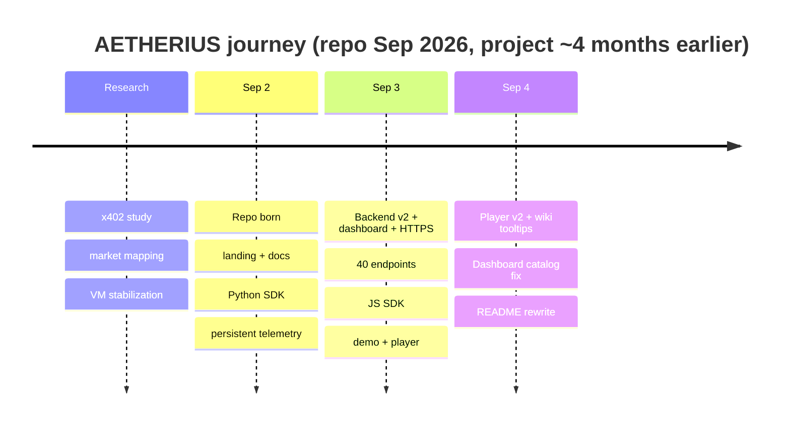
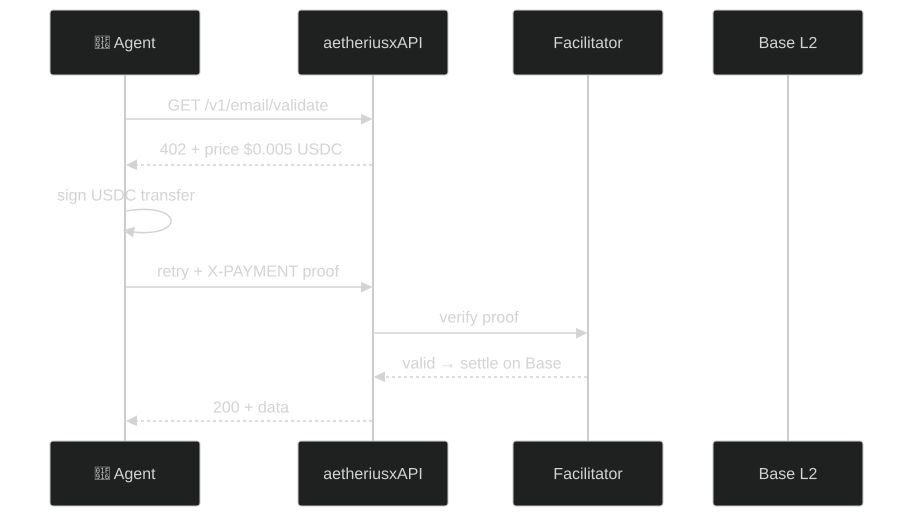

<div align="center">


# AETHERIUS — aetheriusxAPI

<div align="center">

# 🛡️ OUR DOCTRINE IS NOT DOGMA, IT'S A GUIDE FOR ACTION

</div>

### The Operating System for AI Agent Commerce

**40 live APIs (120+ on the roadmap) where autonomous AI agents pay per request in USDC on Base.**
**No accounts. No subscriptions. No human friction. Just code.**

[Website](https://wilnowilx.github.io/aetheriusxapi/) · [Documentation](https://github.com/wilnowilx/aetheriusxapi/blob/main/docs/API.md) · [Tutoriales (ES)](https://github.com/wilnowilx/aetheriusxapi/tree/main/docs/tutorials) · [Twitter](https://x.com/aetheriusxAPI) · [Telegram](https://t.me/aetheriusxAPI) · [x402 Protocol](https://x402.org)

</div>

---

## Table of Contents

- [⏱️ Time Since Repo Born](#%EF%B8%8F-time-since-repo-born)
- [🗺️ Build Timeline](#%EF%B8%8F-build-timeline)
- [🔥 The Problem](#-the-problem)
- [🔭 The Vision](#-the-vision)
- [🧠 Mental Model](#-mental-model-how-x402-changes-everything)
- [🗺️ System Overview](#%EF%B8%8F-system-overview)
- [🏗️ Architecture](#%EF%B8%8F-architecture)
- [📡 Live Status](#-live-status)
- [🎬 Live Demo](#-live-demo)
- [🐍 SDKs](#-sdks)
- [🚀 Quick Start](#-quick-start)
- [🎛️ Dashboard](#%EF%B8%8F-dashboard)
- [🔌 Endpoints](#-endpoints)
- [🗂️ Categories](#%EF%B8%8F-categories)
- [🧱 Tech Stack](#%EF%B8%8F-tech-stack)
- [🛣️ Roadmap](#%EF%B8%8F-roadmap)
- [💰 Grant Application](#-grant-application)
- [🤝 Contributing](#-contributing)
- [📄 License](#-license)
- [🔗 Links](#-links)

---

## ⏱️ Time Since Repo Born

<!-- AUTO-UPDATE: Change EPOCH to the repo birth date (first commit). The badge auto-computes days/hours/mins. -->
<!-- EPOCH = 2026-09-02T00:00:00Z  (repo first commit) -->
<!-- To update: just push any commit — this badge regenerates on every page load. -->

<div align="center">


> **Repo born:** Sep 2, 2026 — `3a6aeb6` "Initial commit"

</div>

---

## 🗺️ Build Timeline

<!-- RITUAL: append a row + gantt bar on every release. This timeline stays alive. -->
<!-- Repo history below is exact (git). Pre-repo phases are honest ranges from project records. -->
<!-- Minutes between deploys are real (git timestamps). -->



| Phase | Work | Time | Verify |
|-------|------|------|--------|
| May–Aug 2026 | Research, x402 study, VM stabilization — an idea this size needs study before it can be visualized | ~4 months | workspace history |
| **Sep 2** — 1st deploy | Repo born, landing page, docs, Python SDK, persistent SQLite telemetry | **t+0 min** | `git log --oneline 3a6aeb6` |
| **Sep 2** — 2nd deploy | Backend v2.0, 40 endpoints, real USDC on Base Sepolia, 5-source price chain | **t+47 min** | `git log --oneline --since="2026-09-02" --until="2026-09-03"` |
| **Sep 3** — 3rd deploy | Dashboard OS mode, HTTPS (Let's Encrypt), CORS, JS SDK, 60/60 tests | **t+18h 23min** | `git log --oneline --since="2026-09-03"` |
| **Sep 3** — 4th deploy | Demo player, cast replay, typewriter, 10+ tutorials EN/ES | **t+22h 41min** | same |
| **Sep 3** — 5th deploy | README brutal (7 SVG diagrams), release v2.0.0, 15 GitHub topics | **t+23h 15min** | `git tag -l` |
| **Sep 4** — 6th deploy | Player v2 (wiki tooltips, SVG icons, right-aligned), dashboard catalog fix | **t+48h 06min** | `git log -1 --format=%H` |

**Total commits:** 90+ and counting (`git log --oneline | wc -l` — velocity is public).

**Build velocity:** 40 endpoints + 60 tests + 2 SDKs + dashboard + landing + demo in **48 hours**.
If one person builds this in 48 hours, imagine what funded builders ship on Base.

---

## 🔥 The Problem

### Problem statement

Most APIs are designed for a human-led workflow: a developer creates an account, provisions credentials, accepts a subscription or credit limit, and reconciles usage through a separate billing system. That model works for teams, but adds coordination and trust boundaries when the client is an autonomous agent.

An agent needs to discover a service, authorize a bounded amount, call it, and receive a verifiable result without a human present for every transaction. API keys identify a client but do not provide per-request authorization; subscription billing separates consumption from settlement; and conventional payment rails are not optimized for low-value, high-frequency machine-to-machine calls.

### What we verified in production

- Testnet facilitators verify signatures without always settling on-chain — our volume metric counts facilitator-approved payments, stated as such.
- Datacenter IPs get throttled by free upstreams (CoinGecko 429s, Etherscan V1 deprecation) — hence mirror chains and multi-source fallbacks, not bigger promises.
- A `402` with an empty body is the honest challenger: no proof, no data.
- Naming these plainly is what separates our docs from generic API-marketplace copy.

### Thesis

If payment authorization and API access are expressed in the same HTTP interaction, an agent can consume external capabilities autonomously while the provider keeps a standard request/response interface. x402 provides that interaction: the provider returns `402 Payment Required` with machine-readable requirements, the client supplies a payment proof, and the request is verified and settled with USDC on Base.

### Engineering requirements

| Requirement | Design implication |
|-------------|-------------------|
| **Programmatic authorization** | Approve a specific request and amount without sharing a long-lived secret. |
| **Usage-based economics** | Keep price, request, response, and settlement correlated at the API boundary. |
| **Low-value viability** | Support micro-payments without monthly commitments. |
| **Provider compatibility** | Keep services as ordinary HTTP APIs protected by middleware. |
| **Operational verifiability** | Measure health, latency, payment events, and failures independently. |

**AetheriusX hypothesis:** a marketplace of capability APIs with x402-native settlement can reduce the operational friction of agent commerce while preserving familiar HTTP semantics. The hypothesis is testable through payment conversion, latency, repeat usage, request success rate, and settled volume.

---

## 🔭 The Vision


**Mission:** Become the default API layer for autonomous agents — the Stripe of the agent economy.

**Strategy:**
1. **Live now:** 8 categories, 40 endpoints verified with real USDC on Base Sepolia
2. **Next:** mainnet (1 env var + funding) + 10-per-category depth
3. **Scale** to 120+ with grant funding, then 500+
4. **Become** the infrastructure that AI agents depend on

---

## 🧠 Mental Model: How x402 Changes Everything

### The Old World (API Key Era)


### The New World (x402 Protocol)


### Key Concepts

| Concept | Definition | Why It Matters |
|---------|-----------|----------------|
| **x402** | HTTP 402 status code repurposed for crypto payments | Standardized machine-to-machine payment protocol |
| **USDC** | USD-pegged stablecoin on Base L2 | Stable value, sub-cent fees, instant settlement |
| **Base** | Ethereum L2 by Coinbase | Low gas fees, high throughput, Coinbase integration |
| **Facilitator** | Service that verifies payment proofs on-chain | Trustless verification without intermediaries |
| **Wallet-as-Identity** | Your Ethereum address = your account | No signup, no KYC, no email, no password |

---

## 🗺️ System Overview




---

## 🏗️ Architecture


---

## 📡 Live Status

| Signal | Value |
|--------|-------|
| Network | Base Sepolia `eip155:84532` (mainnet after funding) |
| Mode | `real` — on-chain USDC verification via facilitator |
| Health | `GET /health` (free) |
| Telemetry | `GET /v1/telemetry` (free): uptime, per-endpoint stats, settled USDC volume |
| Dashboard | [`/dashboard/`](https://wilnowilx.github.io/aetheriusxapi/dashboard/) + backend bar |
| Live API | `http://34.156.149.38/aetherapi` · TLS `https://34-156-149-38.sslip.io/aetherapi` |
| Version | v2.0.0 · 40 endpoints · 60/60 tests green |

Snapshot 2026-09-03: E2E 6/6 paid endpoints → 200 with real settlement.

---

## 🎬 Live Demo

Unedited terminal replay. One agent, one call, real USDC on Base Sepolia.
What you see is exactly what a paying client gets.

**[▶ Watch the demo](https://wilnowilx.github.io/aetheriusxapi/docs/demo/player.html)**

The replay shows the full x402 loop — discovery, payment challenge, settlement, data. No cuts, no simulated responses, no fake data. Every response is a real endpoint on testnet. The telemetry you see on the dashboard updates live.

**[Dashboard](https://wilnowilx.github.io/aetheriusxapi/dashboard/)** · [raw .cast](https://wilnowilx.github.io/aetheriusxapi/docs/demo/take-1.cast) · [script](docs/demo/demo_90s.py)

---

## 🐍 SDKs

### Python (`sdks/python/`)

```bash
pip install -e ./sdks/python
```

```python
from aetheriusx import AetheriusXClient

with AetheriusXClient() as client:  # default: http://127.0.0.1:4020
    print(client.health()["version"])
    route, price = client.discover_cheapest()  # cheapest paid endpoint
    res = client.paid_get(route, {"email": "user@example.com"}, payment="anything")
    print(res.status_code, res.json())
```

`payment` is caller-supplied: any string works in local simulated mode,
live testnet needs a real x402 USDC proof. The client never touches private keys.

### JavaScript (`sdks/javascript/`)

```bash
npm install aetheriusx
```

```javascript
import { AetheriusXClient } from "aetheriusx";

const client = new AetheriusXClient(); // default: http://127.0.0.1:4020
const health = await client.health();
console.log(health.version);

const { route, price } = await client.discoverCheapest();
const res = await client.paidGet(route, { email: "user@example.com" }, { payment: "anything" });
console.log(res.status, res.data);
```

Runnable flows: [`examples/`](examples/)

---

## 🚀 Quick Start

### For AI Agents (Buyers)

```bash
# Install the SDK
pip install aetheriusx
```

```python
from aetheriusx import Client

# Initialize with your wallet
client = Client("0xYourWalletAddress")

# Call any API — payment is automatic
response = client.get("/v1/crypto/price",
    params={"token": "ETH"})

print(response.data)
# {"price": 2384.50, "change": 2.3}
# That's it. Payment handled via x402.
```

### For API Providers (Sellers)

```python
from fastapi import FastAPI
from x402.http import FacilitatorConfig, HTTPFacilitatorClient
from x402.http.middleware.fastapi import PaymentMiddlewareASGI

app = FastAPI()

# Add x402 payment middleware
facilitator = HTTPFacilitatorClient(
    FacilitatorConfig(url="https://x402.org/facilitator")
)

app.add_middleware(PaymentMiddlewareASGI, routes={
    "GET /your-endpoint": {
        "accepts": [{
            "scheme": "exact",
            "pay_to": "0xYourWallet",
            "price": "$0.01",
            "network": "eip155:8453"
        }],
        "description": "Your premium API endpoint",
    }
}, server=facilitator)
```

---

## 🎛️ Dashboard

Interactive control room (no build step, vanilla JS) served by the backend itself:

```bash
uvicorn main:app --reload --port 4020
# open http://127.0.0.1:4020/dashboard/
```

- **API Catalog** — all 40 endpoints with live prices from `/health`
- **Explorer** — param forms, one-click paid calls, `Show 402` renders the payment challenge
- **Live Metrics** — REAL server telemetry (`/v1/telemetry`): uptime, totals, settled USDC volume, wallets seen, latency bars, event feed. Zero simulated numbers.
- **Wallet** — memory-only demo connect (real x402 signing in production client)
- **Storage Drift** — probes `/v1/storage/drift`, shows planned payload until Phase 2
- **Activity** — client-side call log

Live (testnet): `http://34.156.149.38/aetherapi/dashboard/`

---

## 🔌 Endpoints

| Endpoint | Description | Price | Latency |
|----------|-------------|-------|---------|
| `GET /v1/maps/search` | Business search via OpenStreetMap | $0.01 | ~120ms |
| `GET /v1/maps/reviews` | Place lookup via OpenStreetMap | $0.02 | ~200ms |
| `GET /v1/maps/nearby` | Nearby places by coordinates | $0.015 | ~90ms |
| `GET /v1/maps/reverse` | Coordinates to address | $0.01 | ~80ms |
| `GET /v1/maps/geocode` | Forward geocoding | $0.01 | ~90ms |
| `GET /v1/token/analyze` | Token contract analysis | $0.02 | ~80ms |
| `GET /v1/token/holders` | Holder distribution (key-gated) | $0.03 | ~60ms |
| `GET /v1/token/price` | Real-time token price | $0.005 | ~30ms |
| `GET /v1/token/prices` | Batch token prices | $0.01 | ~40ms |
| `GET /v1/token/gas` | Gas oracle | $0.01 | ~25ms |
| `GET /v1/token/balance` | ETH balance | $0.01 | ~35ms |
| `GET /v1/token/transactions` | Wallet transactions | $0.02 | ~70ms |
| `GET /v1/token/global` | Global crypto stats | $0.01 | ~50ms |
| `GET /v1/web/scrape` | Universal web scraper | $0.01 | ~150ms |
| `GET /v1/web/screenshot` | Website screenshot capture | $0.025 | ~300ms |
| `GET /v1/web/geoip` | IP geolocation | $0.008 | ~40ms |
| `GET /v1/web/dns` | DNS lookup | $0.005 | ~30ms |
| `GET /v1/email/validate` | Email verification | $0.005 | ~40ms |
| `GET /v1/data/weather` | Current weather | $0.008 | ~50ms |
| `GET /v1/data/forecast` | 7-day forecast | $0.008 | ~60ms |
| `GET /v1/data/airquality` | Air quality index | $0.008 | ~45ms |
| `GET /v1/data/define` | Dictionary definitions | $0.005 | ~30ms |
| `GET /v1/data/words` | Word relations (syn/ant) | $0.005 | ~25ms |
| `GET /v1/data/elevation` | Elevation lookup | $0.005 | ~35ms |
| `GET /v1/storage/drift` | Cross-RPC slot drift | $0.02 | ~140ms |
| `GET /v1/defi/yields` | Top yield pools | $0.02 | ~90ms |
| `GET /v1/defi/stablecoins` | Stablecoin list | $0.01 | ~60ms |
| `GET /v1/defi/fees` | Protocol fees | $0.015 | ~70ms |
| `GET /v1/defi/tvl` | Chain TVLs | $0.01 | ~55ms |
| `GET /v1/defi/protocols` | Protocols by TVL | $0.01 | ~65ms |
| `GET /v1/defi/dexs` | DEX volumes | $0.015 | ~75ms |
| `GET /v1/defi/stablecoinchains` | Stables by chain | $0.01 | ~50ms |
| `GET /v1/defi/stablecoin-history` | Stable history | $0.01 | ~80ms |
| `GET /v1/forex/rates` | Fiat FX rates | $0.008 | ~40ms |
| `GET /v1/forex/history` | Historical FX | $0.01 | ~60ms |
| `GET /v1/forex/convert` | Currency conversion | $0.008 | ~35ms |
| `GET /v1/news/hackernews` | HN front page | $0.01 | ~50ms |
| `GET /v1/news/hn-item` | HN item by ID | $0.005 | ~30ms |
| `GET /v1/news/hn-user` | HN user profile | $0.005 | ~25ms |
| `GET /v1/news/hn-feed` | HN Ask/Show/Jobs | $0.01 | ~45ms |

> **Note:** These are the initial 40 endpoints. With Base Builder Grant funding, we'll expand to **120+ endpoints across 12 categories.**

---

## 🗂️ Categories

| Category | APIs | Examples |
|----------|------|----------|
| **Maps & Location** | 5 | Geocoding, business search, nearby places, reverse geocode |
| **Crypto & Tokens** | 8 | Price feeds, token analysis, holder tracking, gas oracle |
| **Web & Scraping** | 4 | Web scraper, screenshots, DNS, IP geolocation |
| **Email & Data** | 6 | Email validation, weather, forecasts, definitions, elevation |
| **DeFi & Finance** | 8 | Yields, TVL, stablecoins, DEX volumes, protocol fees |
| **Forex** | 3 | Live rates, historical data, currency conversion |
| **News & Media** | 4 | Hacker News front page, items, users, Ask/Show/Jobs |
| **Storage & infra** | 2 | Cross-RPC drift, on-chain verification |

---

## 🧱 Tech Stack


| Component | Technology | Purpose |
|-----------|-----------|---------|
| **Server** | FastAPI (Python) | High-performance async API server |
| **Protocol** | x402 | HTTP 402 with crypto payments |
| **Payments** | USDC on Base | Stablecoin payments on L2 |
| **Facilitation** | Coinbase CDP | Payment verification and settlement |
| **Hosting** | GCP Compute Engine | Global edge deployment |
| **Proxy** | Nginx | Rate limiting, SSL, load balancing |
| **Process** | Systemd | Service management and auto-restart |
| **Dashboard** | Vanilla JS | Zero-build interactive control room |
| **SDKs** | Python + JavaScript | Agent integration libraries |

---

## 🛣️ Roadmap

### Phase 1: Foundation (Current)
- [x] Core API server with x402 middleware (simulated + real modes)
- [x] 40 endpoints, 40 verified live with real USDC payments (no mocked data)
- [x] E2E payment flow proven on testnet (6/6 → 200, real USDC settled)
- [x] Upstream resilience (Overpass mirrors, 5-source price chain, Nominatim fallbacks)
- [x] Interactive dashboard (`/dashboard/`) with API explorer
- [x] Coinbase CDP API credentials
- [x] Professional landing page with aurora plasma background
- [x] Demo player with wiki tooltips and typewriter replay
- [x] Python + JavaScript SDKs
- [x] 10+ tutorials EN/ES
- [ ] **Mainnet deployment** (pending ETH funding)
- [ ] Base grant applications (Creator + Ecosystem Fund)

### Phase 2: Scale (Post-Grant)
- [ ] Expand to 120+ endpoints
- [ ] 12 API categories
- [ ] SDK releases (Go, Rust)
- [ ] Developer dashboard with analytics
- [ ] Rate limit management UI
- [ ] Community-contributed endpoints

### Phase 3: Ecosystem (Q1 2027)
- [ ] Third-party API provider onboarding
- [ ] Revenue sharing model
- [ ] Agent marketplace
- [ ] Enterprise tier with SLA
- [ ] Multi-chain support (Ethereum, Polygon, Arbitrum)

---

## 💰 Grant Application

We are applying for the **Base Builder Grants** program:

- **Amount:** $5,000 seed + GTM support
- **Use of funds:** Mainnet deployment, expand to 120+ endpoints, SDK development
- **Timeline:** 4 weeks post-funding
- **Metrics:** First 100 paying API consumers within 90 days

[Application text](application.md) · [Base Builder Grants](https://www.base.org/ecosystem-fund/apply)

---

## 🤝 Contributing

**AETHERIUS is open-source. Every line of code is public. Every transaction is verifiable on-chain.**

### Why contribute?

| What you build | Why it matters |
|----------------|----------------|
| **New API endpoints** | Every endpoint you add becomes part of the agent economy — discoverable, payable, verifiable |
| **SDK improvements** | Better SDKs = more agents = more volume = more fees for everyone |
| **Documentation** | English + Spanish tutorials expand the market from 1B to 1.5B developers |
| **Infrastructure** | Nginx configs, CI/CD, monitoring — the boring stuff that makes everything else work |
| **Community** | Translations, examples, bug reports, Discord support |

### The vision you're building toward

> **"The operating system for AI agent commerce."**
>
> A world where autonomous agents discover, pay for, and consume APIs without
> human friction. No accounts. No subscriptions. Just code and crypto.
>
> AETHERIUS is building the infrastructure layer for that world. Every
> endpoint, every SDK improvement, every documentation page brings us closer
> to a future where 500M+ Spanish-speaking developers have equal access to
> the agent economy.

### What you get

- **Lifetime 50% off** every endpoint (Founding Agents)
- **Vote on the roadmap** — you steer what ships
- **Your name in the codebase** — git log is forever
- **Real-world impact** — your code runs on Base, settles USDC, and powers autonomous agents
- **Open-source portfolio** — contributions are public and verifiable

### Development Setup

```bash
# Clone the repository
git clone https://github.com/wilnowilx/aetheriusxapi.git

# Navigate to the project
cd aetheriusxapi

# Install dependencies
pip install -r requirements.txt

# Run the server locally
uvicorn main:app --reload --port 4020

# Open dashboard
# http://127.0.0.1:4020/dashboard/

# Run tests
pytest -q
```

### First-time contributors

1. Check [open issues](https://github.com/wilnowilx/aetheriusxapi/issues) for `good-first-issue`
2. Fork → branch → commit → PR
3. Tests must pass (`pytest -q`)
4. One review minimum

---

## 📄 License

MIT License — see [LICENSE](LICENSE) for details.

---

## 🔗 Links

| Resource | URL |
|----------|-----|
| **Website** | [wilnowilx.github.io/aetheriusxapi](https://wilnowilx.github.io/aetheriusxapi/) |
| **Documentation** | [GitHub Docs](https://github.com/wilnowilx/aetheriusxapi/blob/main/docs/API.md) |
| **Twitter** | [@aetheriusxAPI](https://x.com/aetheriusxAPI) |
| **Telegram** | [@aetheriusxAPI](https://t.me/aetheriusxAPI) |
| **GitHub** | [wilnowilx/aetheriusxapi](https://github.com/wilnowilx/aetheriusxapi) |
| **x402 Protocol** | [docs.x402.org](https://docs.x402.org) |
| **Base** | [base.org](https://base.org) |
| **Live API** | [api.aetheriusx.io](https://api.aetheriusx.io) |

---

<div align="center">

**Built for the agent economy.**

AETHERIUS — The infrastructure that lets AI agents pay for themselves.

[](https://x.com/aetheriusxAPI)
[](https://github.com/wilnowilx/aetheriusxapi)
[](https://t.me/aetheriusxAPI)

**Built for AETHERIUS** 💜

</div>
