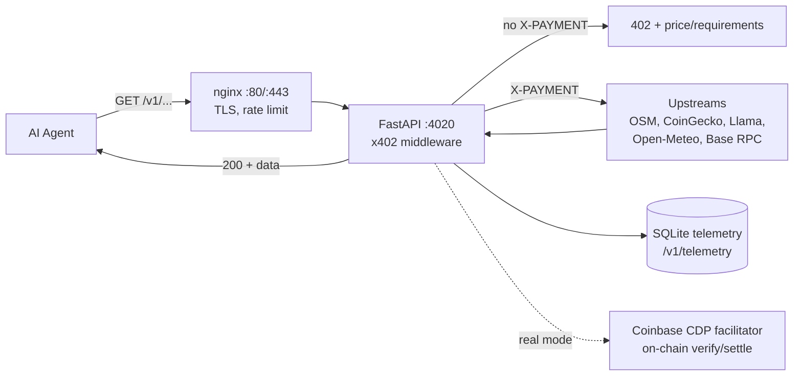

# Architecture (production, as it runs now)

> Scope: request flow + deployment topology. For protocol details see
> [[x402-Protocol]]; for incident steps see [[Runbooks]]; for *why* see [[ADRs]].

**Status:** Active · **Owner:** maintainers · **Review trigger:** new datastore,
new public endpoint, dependency change, traffic/topology move.

## Purpose (two paragraphs)

AETHERIUS is a crypto-native API marketplace: 100 HTTP endpoints (60 paid,
40 free) where autonomous agents pay per request in USDC on Base via x402.
No accounts, no keys — the wallet is the identity.

The backend is one FastAPI service behind nginx. A payment middleware guards
paid routes (402 challenge → verify → 200). A free intelligence layer reads
Base Mainnet + keyless upstreams. Telemetry persists to SQLite and is served
live. The landing is a static React build on GitHub Pages; the dashboard is
vanilla JS served by the backend itself.

## Request flow

Live mode is **simulated** (any non-empty `X-PAYMENT` settles); the facilitator
path exists for real mode. Volume accounting counts facilitator-approved
payments and says so — see ADR-001.

## Async/internal flow

- Telemetry writes are request-scoped (SQLite). No background workers in v2.0.
- NATS carries internal runtime events between layers; it stays private and is
  **not** a public surface. The product exposes its *proof* (health, latency,
  volume) via `/v1/telemetry`, not the bus.
- Landing telemetry/heartbeat widgets poll the public endpoints only.

## Environments

| Env | Frontend | Backend | Data |
|---|---|---|---|
| Local | `frontend/ npm run dev` | `uvicorn :4020` | ephemeral SQLite |
| Prod | GitHub Pages (static build) | GCP VM `sentinel-v4`, systemd `aetherapi.service`, nginx reverse proxy | persistent SQLite on VM |

## Known constraints (honest)

- **Single VM = SPOF.** No multi-region failover in v2.0. Mitigation: systemd
  auto-restart, health checks, fast redeploy per [[Runbooks]] R2.
- **Datacenter-IP throttling.** Free upstreams 429 datacenter ranges
  (CoinGecko) — hence mirror chains + multi-source fallbacks, not bigger promises.
- **`/health` endpoint catalog lags code.** The dict advertises 80 routes while
  ~100 are live; treat code + live probes as truth until the dict is regenerated.
- **Simulated settlement live.** Real-USDC path is proven in tests/facilitator
  integration, not the default live mode — see ADR-001.
