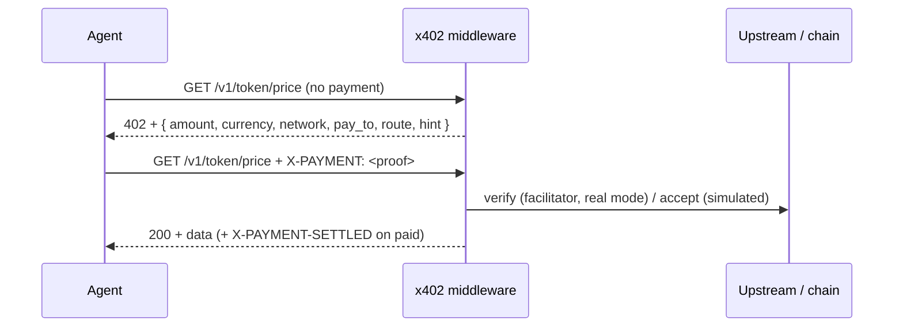

# x402 Protocol (as implemented here)

> Scope: the payment loop inside this repo — challenge shape, headers, modes,
> replay defense, free-vs-paid. For the cross-vendor standard (incl. the MCP
> transport), see `docs.x402.org` and `specs/transports-v2/mcp.md` upstream.
> Zero PRs upstream from this project for now — we build on our side.

**Status:** Active · **Owner:** maintainers · **Review trigger:** middleware change.

## The loop (5 steps)

- **Challenge:** `402` with machine-readable body. An empty-body 402 is also
  valid — *no proof, no data*, and the client must treat it as the end of the road.
- **Payment:** `X-PAYMENT` header carrying the proof. Simulated mode accepts any
  non-empty value; real mode verifies via the facilitator on Base (`eip155:8453`, USDC).
- **Settlement header:** paid 200s carry `X-PAYMENT-SETTLED`. Tests assert it.

## Free vs paid

- **FREE (40):** `/v1/x402/*` (20 Intelligence + 20 QuantumXBrain) plus
  `/health`, `/v1/telemetry`. Never require payment; a 402 here is a regression.
- **Paid (60):** everything else per `PRICES` in `main.py`. Without `X-PAYMENT`
  they MUST return 402 (gated by tests).

## Replay defense (TOCTOU)

Payment proofs are single-use: a nonce cache rejects duplicates with **409**
(same proof, same route reuse blocked; whitespace normalized). Covered by
9 dedicated tests. Defense layers: ephemeral nonce + TTL, atomic single-use
claim, proof bound to route+method (a cheap-tool proof never pays for an
expensive tool).

## Client policy (for agent builders)

Enforce spend rules **in code next to the payment client**, never by prompt
alone: max amount/currency, expected network+scheme, expected route/facilitator,
per-agent/per-session caps. Reject mismatched requirements *before* signing.
